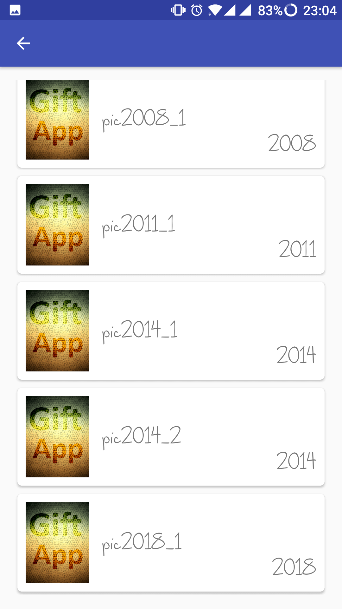

# Gift App
This was a small project I created to serve as an aniversary gift, since it can be easily customized I decided to import to github from my private repository to share.

## The idea
So the application purpose is very simple, it shows the years that you know the person, and with each selected year you can see pictures from those specific years, but in order to see them you have to answer one small question.

## Some screenshots

<p align="center">
  
  
  
</p>

## How to customize?
Well all you have to do is edit the <b><i>Strings.xml</i></b> file and edit the questions, answers and the ammount of pictures you want. Next place the pictures on the assets folder ordered by the years you want. 
Once you've done that all you have to do is organize this information through the <b><i>AppConstants.java</i></b>:

For questions:
```java
  Q1(R.string.q1                                                  // Question Header
    ,Arrays.asList(R.string.aq11, R.string.aq12, R.string.aq13)   // Question Answers
    ,1)                                                           // Index of the correct answer (starting at 1)
```

For Images:
```java
    Y2003("2003"                                                  // Year title
      ,Arrays.asList("images/2003/1.png","images/2003/2.png")     // Images from these years
      ,R.array.image_desc_2003)                                   // Array of images descriptions
```

## What did I use?
Well the main objective of the application was, as I said, to give as a gift, however I took this opportunity to explore some external libraries, and here are some of them and my thoughts:

  * <b>Bubble Picker</b> ([see GitHub](https://github.com/igalata/Bubble-Picker))
  <p>
  Well this is the core off the application, this is what gave me idea in the first place, It's great, but have some improvements to be done, such as: bubble speed and possibility to select all.
  </p>
  
  * <b>Butter Knife</b>  ([see GitHub](https://github.com/JakeWharton/butterknife))
  <p>
  This was the one I wanted to try for a long time, it enables fields and methods bindings, believe me this spares you a lot of time.
  </p>
  
  * <b>Toasty</b>        ([see GitHub](https://github.com/GrenderG/Toasty))
  <p>
  Simple and efective toast message component. I just wanted to try it out, but you can live without it.
  </p>
  
  * <b>Panter dialog</b> ([see GitHub](https://github.com/kngfrhzs/panter-dialog))
  <p>
  Customizable dialog but with some limitations, if I had the time when I created this application I would create one of my own, but this takes some time, if you are short on time this is for you.
  </p>
  
  ## TODO
    * Add - properties file to full customization.
    * Add - see image on Full Screen
